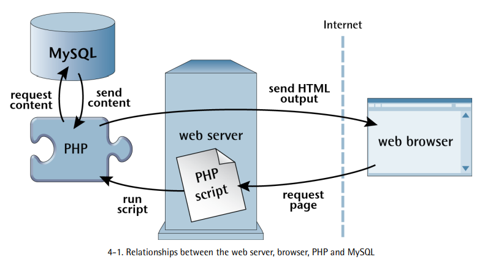

# PHP & MySQL: Novice to Ninja

> Build your own powerful web applications

## 1. Setup Local Development 

PHP is a server-side scripting language. You can think of it as a plugin for your web server that enables it to do more than just send exact copies of the files requested by web browsers. With PHP installed, your web server will be able to run little programs (called PHP scripts) that can do tasks like retrieve up-to-the-minute information from a database and use it to generate a web page on the fly, before sending it to the browser that requested it. Much of this book will focus on writing PHP scripts to do exactly that. 

MySQL is a `relational database management system`, or `RDBMS`. We'll discuss the exact role it plays and how it works later, but brefly, it's a software program that's able to organize and manage many pieces of information efficiently while keeping track of how all those pieces of information are related to each other. MySQL also makes that information really easy to access with server-side scripting languages such as PHP. And, like PHP, it's completely free for most uses.

When developing static websites, you can simply load your HTML files directly from your hard disk into your browser to see how they look. There's no web server software involved when you do this, which is find, because web browsers can read and understand HTML code all by themselves.

However, when it comes to dynamic websites built using PHP and MySQL, your web browser needs some help. Web browsers are unable to understand PHP scripts. Instead, PHP scripts contain instructions for a PHP-savvy web server to execute in order to generate the HTML code that browsers can understand.

## 2. Introducing PHP 

PHP is a server-side language.

A server-side language is similar to JavaScript in that it allows you to embed little programs (scripts) into the HTML code of a web page. When executed, these programs give you greater control over what appears in the browser window than HTML alone can provide. The key difference between PHP and Javascript is the stage of loading the web page at which these embedded programs are executed.

PHP run by the web server, before sending the web page to the browser. The server-side languages let you generate customized pages on the fly before they're even sent to the browser.

Once the web server has executed the PHP code embedded in a web page, the result takes the place of the PHP code in the page. All the browser sees is standard HTML code when it receives the page. hence the name 'server-side language'.

Server advantages of server-side scripting

- `No browser compatibility issues.`: PHP scripts are interpreted by the web server alone, so there's no need to worry about whether the language features you're using are supported by the visitor's browser. 

- `Access to server-side resources`
- `Reduced load on the client`

Quotes 

PHP supports both single quotes ' and double quotes " to encase strings. For most purposes, they're interchangeable. PHP developers tend to favor single quotes, because we deal with HTML code a lot, which tends to contain a lot of double quotes.

### 2.1. Variables, Operators and Comments 

Variables in PHP are identical to variables in most other programming languages. For the uninitiated, a `variable` can be thought of as a name given to an imaginary box into which any value may be placed.

PHP is a `loosely typed` language. This means that a single variable may contain any type of data - be it a number, a string of text, or some other kind of value - and may store different types of values over its lifetime.

### 2.2. PSR-2

PHP doesn't mind how you format your code and whitespace is ignored. The script will execute in the exact same way. Different programmers have different preferred styles, such as using tabs or spaces for indentation, or placing the opening brace on the same line as the statement or after it. Throughout this book I'll be using a convention known as `PSR-2` but use whatever style you feel most comfortable with. 

## 3. Arrays

An `array` is a special kind of variable that contains multiple values. If you think of a variable as a box that contains a value, an array can be thought of as a box with compartments where each compartment is able to store an individual value. 

To access a value stored in an array, you need to know its `index`. Typically, arrays use numbers as indices to point to the values they contain, starting with zero.

Each value stored in an array is called an `element`. You can use a key in square brackets to add new elements, or assign new values to existing array elements.

## 4. User Interaction and Forms

For most `database-driven` websites these days, you need to do more than dynamically generate pages based on database data. You also need to provide some degree of interactivity, even if it's just a search box.

PHP have a more limited scope when it comes to support for user interaction comparing to JS. As PHP code is only activated when a request is made to the server, user interaction occurs solely in a back-and-forth fashion: the user sends requests to the server, and the server replies with dynamically generated pages.

The key to creating interactivity with PHP is to understand the techniques we can employ to send information about a user's interaction, along with a request for a new web page. As it turns out, PHP makes this quite easy.

### 4.1. Passing Variables in Links

The simplest way to send information along with a page request is to use the URL query string.

```php
<a href="example.php?name=Hieu">Request</a>
```

This is a link to a file called `example.php`, but as well as linking to the file, you're also passing a variable along with the page request. The variable is called `name`, and its value is `Hieu`.

```php
$name = $_GET['name'];
echo 'Welcome to our website, ' . $name . '!';
```

It turns out that `$_GET` is one of a number of variables that PHP automatically creates when it receives a request from a browser. PHP creates `$_GET` as an array variable that contains any values passed in the URL query string. `$_GET` is an associative array, so the value of the `name` variable passed in the query string can be accessed as `$_GET['name']`.

The user can type any `HTML` code into the `URL`, and your PHP script includes it in the code of the generated page without question. The malicious user could include sophisticated JavaScript code that performs some low action like stealing the user's password. All the attacker would have to do is publish the modified link on some other site under the attacker's control, and then entice one of your users to click it. The attacker could even embed the link in an email and send it to your users. If one of your users clicked the link, the attacker's code would be included in your page and the trap would be sprung!

Perform security 

```php
$name = $_GET['name'];
echo 'Welcome to our website, ' . htmlspecialchars($name, ENT_QUOTES, 'UTF-8') . '!';
```

What `htmlspecialchars` does is convert "special HTML characters" like < and > into `HTML` character entities like `&lt;` and `&gt;`, which prevents them from being interpreted as HTML code by the browser.

Passing a single variable in the query string was nice, but it turns out you can pass more than one value if you want to!

```php
<a href="example.php?firstname=Hieu&lastname=Nguyen">Request</a>
```

This time, our link passes two variables: `firstname` and `lastname`. The variables are separated in the query string by an ampersand (`&`, which should be written as `&amp;`)

### 4.2. Passing Variables in Forms

```html
<form action="name.php" method="post">
	<label for="firstname">FirstName:</label>
	<input type="text" name="firstname" id="firstname" />

	<label for="lastname">LastName:</label>
	<input type="text" name="lastname" id="lastname" />

	<input type="submit" value="Submit" />
</form>
```

The `method` attribute of the form tag is used to tell the browser how to send the variables and their values along with the request.

### 4.3. GET or POST?

As a rule of thumb, you should only use `GET` forms if, when the form is submitted, nothing on the server `changes` - such as when you're requesting a list of search results. Because the search terms are in the URL, the user can bookmark the search results page and get back to it without having to type in the search term again. Buf if, after submitting the form, a file is deleted, or a database is updated, or a record is inserted, you should use `POST`. The primary reason for this is that if a user bookmarks the page (or presses back in their browser) it won't trigger the form submission again and potentially create a duplicate record.

### 4.4. PHP Templates

In the simple examples we've seen so far, inserting PHP code directly into your HTML pages has been a reasonable approach. As the amount of PHP code that goes into generating your average page grows, however, maintaining tis mixture of HTML and PHP code can become unmanageable.

A much more robust approach is to separate out the bulk of your PHP code so that it resides in its own file, leaving the HTML largly unpolluted by PHP code.

the key to doing this is the PHP `include` statement. With an `include` statement, you can insert the contents of another file into your PHP code at the point of the statement.

In `count.php`

```php
<?php 

$output = 'Hello World';

include 'count.html.php';
```

The `include` statement instructs PHP to execute the contents of the `count.html.php` file at this location. You can think of the `include` statement as a kind of `copy` and `paste`. You would get the same result by opening up `count.html.php`, copying the contents and pasting them into `count.php`, overwriting the `include` line.

In `count.html.php`

```php
<!DOCTYPE html>
<html lang="en">
	<head>
	</head>
	<body>
		<p><?php echo $output; ?></p>
	</body>
</html>
```

What we've created here is a PHP template: an HTML page with only very small snippets of PHP code that insert dynamically generated values into an otherwise static HTML page. Rather than embediding the complex PHP code that generates those values in the page, we put the code to generate the values in a separate PHP script.

Using PHP templates like this enables you to hand over your templates to HTML-savvy designers without worrying about what they might do to your PHP code. It also lets you focus on your PHP code without being distracted by the surrounding HTML code.

I like to name my PHP template files so that they end with `.html.php`. As far as your web server is concerned, though, these are still `.php` files; the `.html.php` suffix serves aas a useful reminder that these files contain both HTML and PHP code.

### 4.5. Security Converns

One problem with separating out the HTML and PHP code into different files is that someone could potentially run the `.html.php` code without having had it `included` from a corresponding PHP files.

It's better not to let people run code in a manner you're not expecting. Depending on what the page is doing, this might let them bypass security checks you have in place and view content they shouldn't have access to. For example, consider the following code.

```php
if ($_POST['password'] == 'secret') {
	include 'protected.html.php';
}
```

There are other potential security issues introduced by making all your files accessible via a `URL`. Avoiding security problems like these is easy. You can actually include files from a directory other than the `public` directory.

None of the files outside the `public` directory are accessible via a `URL` (by someone typing the file name into their web browser).

So the question is, when the include files is in a `different` directory, how does a PHP script find it? The most obvious method is to specify the location of the include file as an absolute path. 

A better method is to use a `relative` path. That is, the location of a file relative to the current file. When you use `include 'count.html.php'` this is actually a relative path, `count.html.php` is being included from the same directory as the script that was executed.

PHP provides a constant called `__DIR__`, which will always contain the path that contains the `current file`.

This approach will work on any server, because `__DIR__` will differ depending on where the file is stored, and it doesn't depend on the changing `current working directory`. I'll be using this approach for including files throughout this book.

From now on, we'll only write files to the `public` directory that we actually want users to be able to access directly from theri web browser. The `public` directory will contain any PHP scripts the user needs to access directly along with any images, JS and CSS files required by the browser. Any files only referenced by an `include` statement will be placed outside the `public` directory so users can't access them directly.

### 4.6. Many Templates, One Controller

A PHP script that responds to a browser request by selecting one of several PHP templates to fill in and send back is commonly called a `controller`. A `controller` contains the logic that controls which template is sent to the browser.

```php
<?php 

<form method="POST" action=""></form>
```

The `action` attribute is blank. This tells the browser to submit the form back to the same URL it received it from - in this case, the `URL` of the controller that included this template file.

Example controller 

```php
<?php 

if (!isset($_POST['firstname'])) {
	include __DIR__ . '/../templates/form.html.php';
}
else {
	$firstname = $_POST['firstname'];
	$firstname = htmlspecialchars($firstname);

	include __DIR__ . '/../templates/welcome.html.php';
}
```

The `index.php` is because it has a special meaning. `Index.php` is known as a `directory index`. If you don't specify a filename when you visit the `URL` in your browser, the server will look for a file named `index.php` and display that. 

### 4.7. Bring on the Database

As you may have gegun to suspect, the real powser of PHP is in its hundreds (even thousands) of built-in functions that let you access data in a MySQL database, send email, dynamically generate images, and even create Adobe Acrobat PDF files on the fly.

## 5. Introducing MySQL
## 6. Publishing MySQL data on the Web



This is what happens when there's a visitor to a page on your website:

- The visitor's web browser requests the web page form your web server.
- The web server software (typically Apache or NGINX) recognizes that the requested file is a PHP script, so the server fires up the PHP interpreter to execute the code contained in the file.
- Certain PHP commands (which will be the focus of this chapter) connect to the MySQL database and request the content that belongs in the web page. 
- The MySQL database responds by sending the requested content to the PHP script
- The PHP script stores the content into one or more PHP variables, then uses `echo` statements to ouput the content as part of the web page. 
- The PHP interpreter finishes up by handing a copy of the HTML it has created to the web server.
- The web server sends the HTML to the web browser as it would a plain HTML files, except that instead of coming directly rom an HTML file, the page is the output provided by the PHP interpreter. The browser has no way of knowing this, however. As far as the browser is concerned, it's requesting and receiving a web page like any other.

### 6.1. Connecting to MySQL with PHP
