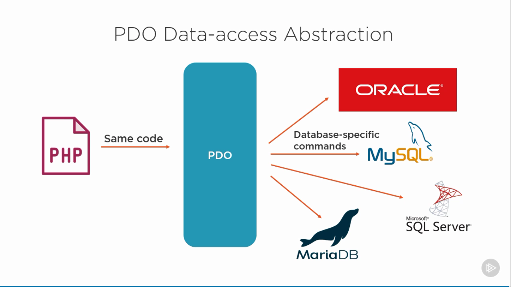
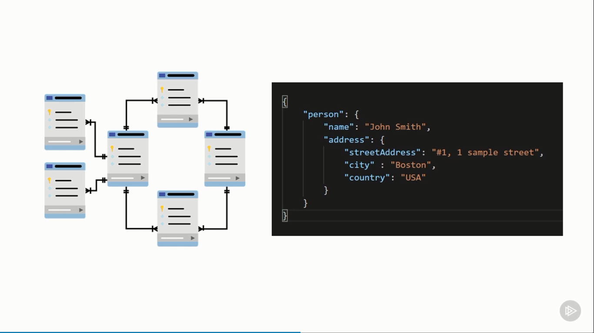

# Working with Databases in PHP

Overview

- Using database extension in PHP
- Using PHP Data Objects
- MongoDB and PHP
- Using Doctrine ORM with PHP

## NoSQL databases

- Flat files
- Graph
- Document
- Cache
- Key-value pair
- Wide column

## Relational databases

- Construct of tables and relationship

## Why to Choose NoSQL over Relational?

- Easier modeling

  No need to define the schema first, easier to update as data and requirements change

- Data structure

  Designed to handle unstructured data, which makes up much of today's data

- Scaling

  Much cheaper to scale a NoSQL database, scaling out over cheap servers

## Which database whould you choose?

- Accounting software

  Relational (fixed columns, low traffic)

- Website cache

  NoSQL (key-value structure)

- Social media platform

  NoSQL (graph)

- Web platform with billions of users

  NoSQL (performance and scalability)

- Highly distributed relational data

  Both (can store relational data in NoSQL)

- Sensor data from thousands of IoT devices

  NoSQL (dynamic fields, high volume, JSON)

## PHP and Relational Databases

Overview:

- MySQL, MariaDB and MS SQL Server
- Connecting to MySQL in PHP
- Connecting to MariaDB in PHP
- Connecting to MS SQL Server in PHP
- Other relational databases

  - Oracle
  - SQLite

### Working with Relationla databases in PHP

- Directly via PHP
- Using PDO
- Other libraries such as Doctrine ORM

### PDO vs. Database Extensions

- PDO supports 12+ different databases
- If switching between relational databases, it makes senses to use PDO
- Both approaches are object oriented
- Both offer protection against SQL injection (prepared statements)

### PHP and MySQL

- PHP 5 and later

  - MySQLi extension
  - PDO

- Earlier PHP versions
  - MySQL extension (deprecated in 2012)

OOP approach

```php

$servername = 'localhost';
$username = 'username'
$password = 'password';

$conn = new mysqli($servername, $username, $password);

if ($conn->connect_error) {
  die('Connection failed: ' . $conn->connect_error);
}

echo 'Successfully connected to MySQL';

```

Procedure approach

```php

$servername = 'localhost';
$username = 'username'
$password = 'password';

$conn = mysqli_connect($servername, $username, $password);

if (!$conn) {
  die('Connection failed: ' . mysqli_connect_error());
}

echo 'Successfully connected to MySQL';

```

#### MySQL operations (CRUD)

- Create database

```php
$sql = "CREATE DATABASE myDB";

if ($conn->query($sql) === true) {
  echo 'Success';
}
else {
  echo 'Error' . $conn->error;
}

```

- Create table

```php
$sql = "CREATE TABLE users (
  id INT(6) UNSIGNED AUTO_INCREMENT PRIMARY KEY,
  firstname VARCHAR(30) NOT NULL,
  lastname VARCHAR(30) NOT NULL,
  email VARCHAR(50)
)";
```

- Insert data

```php
$sql = "INSERT INTO users (firstname, lastname, email)
  VALUES ('', '', '')
";

// object-oriented
$conn->multi_query($sql);

// procedure
mysqli_multi_query($conn, $sql);
```

Prepared statement

```php
$stmt = $conn->prepare("INSERT INTO users (firstname, lastname, email) VALUES (?, ?, ?)");

$stmt->bind_param("sss", $firstname, $lastname, $email);

$firstname = 'Hieu';
$lastname = 'Nguyen';
$email = 'hieuntctk42@gmail.com'

$stmt->execute();
```

Use Prepared Statements to avoid SQ: injection attacks!

- Read data
- Update data
- Delelte data
- Close MySQL connection

```php

// object-oriented
$conn->close();

// procedural
mysqli_close($conn);
```

### PHP and MariaDB

The PHP connectors for MySQL generally work with MariaDB as well

### PHP and Microsoft SQL Server

SQLSRV extension

- Azure SQL Database
- Microsoft SQL Server

PHP Extensions for MS SQL Server

- Mssql extension (Removed in PHP 7.0.0)
- SQLSRV extension (Supported by Microsoft)

```php

$servername = 'localhost, 8080';
$connectionInfo = [
  'Database' => 'dbname',
  'UID' => 'userName',
  'PWD' => 'password'
];

$conn = $sqlsrv_connect($serverName, $connectionInfo);

if (!$conn) {
  echo 'Success';
}
else {
  echo 'Failed';
  die (print_r(sqlsrv_errors(), true));
}

```

Insert data

```php
$sql = "INSERT INTO user(firstname, lastname) VALUES (?, ?)";
$params = ['Hieu', 'Nguyen Trong'];

$stmt = sqlsrv_query($conn, $sql, $params);

if ($stmt === false) {
  die (print_r(sqlsrv_errors(), true));
}
```

Transaction

```php

if (sqlsrv_begin_transaction($conn) === false) {
  die(print_r(sqlsrv_errors(), true));
}

$stmt1 = sqlsrv_query($conn, $sql1, $params1);
$stmt2 = sqlsrv_query($conn, $sql2, $params2);

if ($stmt1 && $stmt2) {
  sqlsrv_commit($conn);
}
else {
  sqlsrv_rollback($conn);
}

```

### Other Relational Databases

- Oracle: OCI8 extension
- DB2: ibm_db2 extension
- MS Access: ODBC
- PostgreSQL: pgsql
- SQLite: SQLite3 extension

## PHP Data Objects (PDO)

The PHP Data Objects (PDO) defines a lightweight, consistent interface for accessing databases in PHP.

- PDO provices a data-access abstraction layer for PHP
- Use the same functions to talk to different relational databases (MySQL, MS SQL, ...)
- PDO ships with PHP 5.1
- You must use a database-specific PDO driver to access a database server

Go to [php.net/manual/en/pdo.drivers.php](php.net/manual/en/pdo.drivers.php)

- Only use for relational databases



### Configure PDO

- Enable PDO extension

Go to [php.net/manual/en/pdo.installation.php](php.net/manual/en/pdo.installation.php)

- Enable database-specific PDO extension
- Update code with PDO syntax

### Using PDO

```php

$servername = 'localhost';
$dbname = 'mydb';
$username = 'username';
$password = 'password';

// Open PDO connection
$conn = new PDO(
  "mysql:host=$servername;dbname=$dbname", $username, $password
);

$conn->setAttribute(PDO::ATTR_ERRMODE, PDO::ERRMODE_EXCEPTION);

$sql = "INSERT INTO users (firstname, lastname) VALUES ('Ha', 'Nguyen Thi')";

$conn->exec($sql);
```

### PDO Supports

- MySQL
- MariaDB
- MS SQL Server
- Oracle
- SQLite
- PostgreSQL
- ...

## PHP and Non-relational Databases

Overview

- A few NoSQL databases to use with PHP
- Configure PHP to use MongoDB
- Performing CRUD

### Quick remainder

#### Relational

Data is structured into multiple related tables with fixed columns

#### NoSQL

Data is structured in means other than tabular relations. Many offerings out there!



### NoSQL Databases

- Flat files
- Graph
- Document
- Cache
- Key-value pair
- Wide column

PHP Supports a Few NoSQL Databases

- MongoDB
- Amazon DynamoDB

Go to [php.net/manual/en/set.mongodb.php](php.net/manual/en/set.mongodb.php)

### MongoClient driver (Deprecated)

```php

$mClient = new MongoClient();
$db = $mClient->sampleDB;

// Create a collection
$collection = $db->createCollection("collection01");

$document = [
  'firstname' => 'Hieu',
  'lastname' => 'Nguyen Trong'
];

$collection->insert($document);

```

### MongoDB driver

#### Insert

```php

// connect
$manager = new Mongodb\Driver\Manager("connection string");

// Create a bulk-write object
$bulk = new MongoDB\Driver\BulkWrite;

$newUser = [
  'firstname' => 'Ha',
  'lastname' => 'Nguyen Thi'
];

$id = $bulk->insert($newUser);

$result = $manager->executeBulkWrite('MyDB.Users', $bulk);

```

#### Selelct All Documents

```php

$query = new MongoDB\Driver\Query([]);
$cursor = $manager->executeQuery("MyDB.Users, $query);

```

#### Update a Document

```php

$bulk = new MongoDB\Driver\BulkWrite;

$bulk->update(
  ['id' => 2010],
  ['$set' => ["firstname" => $firstname]],
  ['multi' => false, 'upsert' => false]
);

```

- `multi` => `false`: Only 1 document is updated
- `upsert` => `false`: Nothing happens if there is no document
- `upsert` => `true`: Auto insert

#### Delete a Document

```php

$bulk = new MongoDB\Driver\BulkWrite;
$bulk->delete(['id' => intval($pid)], ['limit' => 1]);

```
