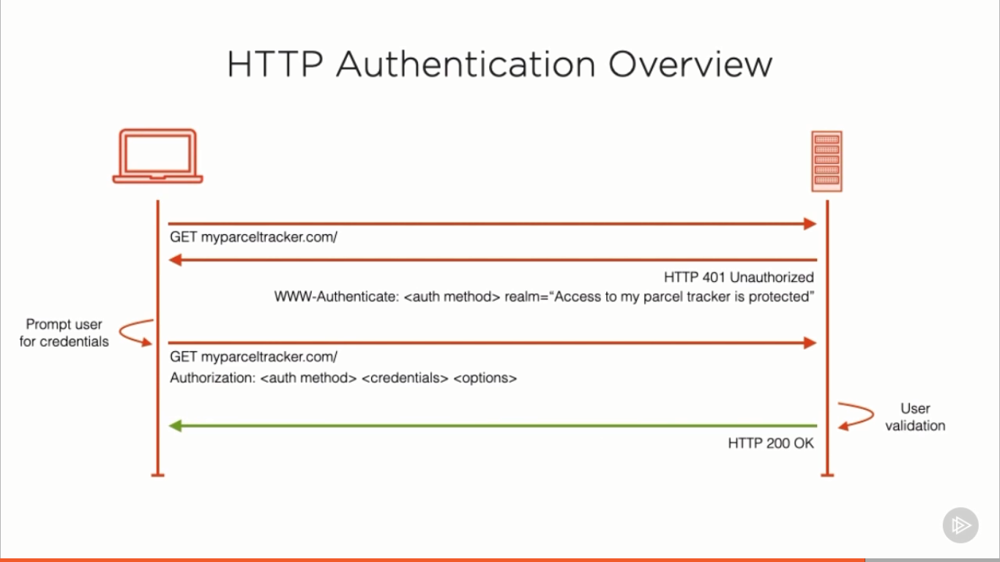
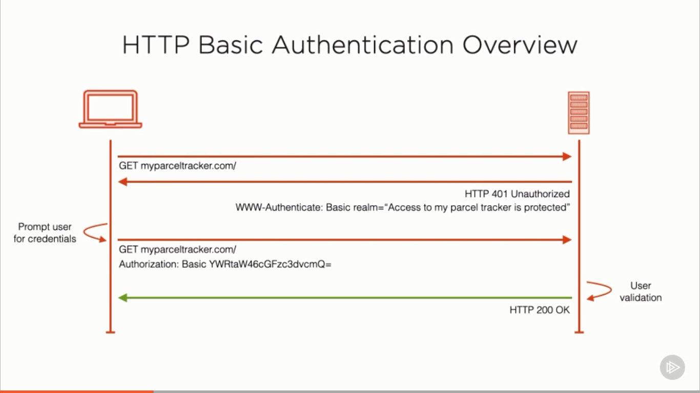
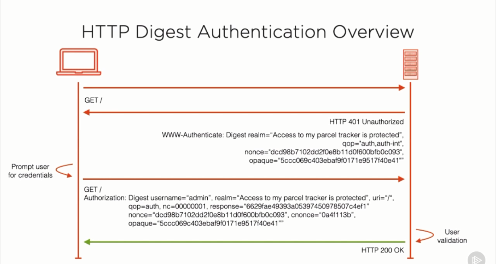
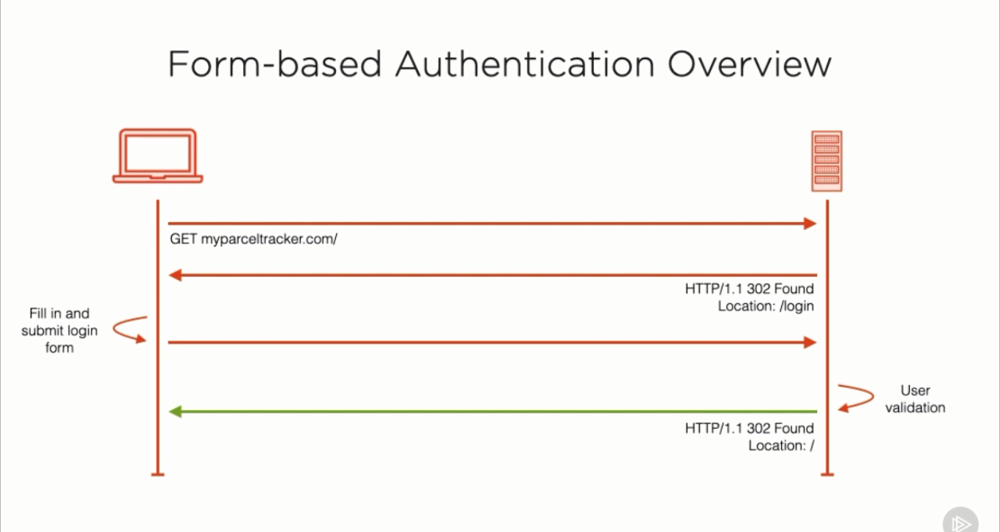
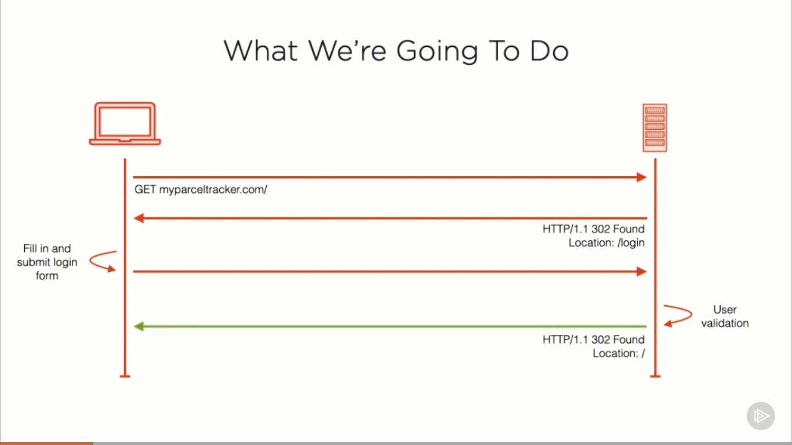

# Authentication and Authorization in PHP

## What is authentication?

Overview:

- A rapid introduction to authentication
- Learn about two common types:
  - HTTP authentication
  - Form-based authentication

The process of verifying the identity of a user, process or device, often as a
prerequisite to allowing access to resources in an information system.

There are multiple authentication types:

- Single-factor authentication
- Multi-factor authentication

### Single-factor Authentication

- Form: filling out username and password
- Biometric data: fingerprint
- An additional item: smart card

### The difference between Authentication and Authorization

- In authentication: you're determining if a user is valid
- In authorization: a user has already been validated

The benefits:

- Only valid users have access
- Access is appropriately authorized

### About HTTP Authentication

Authentication framework, which can be used by a server to challenge a
client request, and by a client to provide authentication information, as
defined by RFC 7235

- Doesn't use login pages
- Uses HTTP headers
- There are 6 types
  - Basic
  - Digest
  - Bearer
  - ...

### About Form-based Authentication

- Has no formal specification
- Uses HTTP and HTML elements (input, hidden, password field)
- It very flexible
- Can be very creative

Please be aware for session cookies:

- Set the HttpOnly and Secure flags to avoid XSS attacks

## HTTP Authentication

Overview:

- What is HTTP authentication?
- Common HTTP authentication methods
- Relevant HTTP headers
- Advantages and disadvantages
- Why HTTPS is essential
- How to implement it in PHP

### What is?

> An authentication framework, which can be used by a server to challenge a client
> request, and by a client to provide authentication information, as defined by
> RFC 7235. It doesn't use login pages, cookies, or session identifiers, rather
> (it uses) standard fields in the HTTP header

### How does HTTP Authentication work?



### HTTP `Basic` Authentication

- Simplistic authentication process
- Authentication method string is `Basic`
- Credentials are colon-concatenated and base64-encoded



Advantages

- Simple to implement
- Quick to deliver
- Passwords can be encrypted
- One round-trip required
- Part of the HTTP specification

Disadvantages

- Credentials are not encrypted
- Vulnerable to Man-in-the-middle attacks
  - Essentials to use HTTPS/TLS
- How do you logout?
  - Restart your browser
  - Clear browser's cache
  - Authenticate with incorrect credentials
- Not the most professional user experience

### Implemnet in PHP

- `PHP_AUTH_USER`: authenticated user
- `PHP_AUTH_PW`: password
- `AUTH_TYPE`: type of authentication

```php
$username = 'admin';
$password = 'admin';

if (!isset($_SERVER['PHP_AUTH_USER'])) {
  header('WWW-Authenticate: Basic realm="Parcel Tracker"');
  header('HTTP/1.0 401 Unauthorized');
  echo 'You must provide a valid username and password to access this application';
  exit;
}

if (
  $_SERVER['PHP_AUTH_USER'] !== $username ||
  $_SERVER['PHP_AUTH_PW'] !== $password
) {
  header('HTTP/1.0 401 Unauthorized');
  echo 'Either your username or password was not valid\n';
  exit;
}
```

### HTTP `Digest` Authentication

Overview:

- Defined in RFC 2069
- Added security enhancements in RFC 2617
- More complex than Basic authentication
- Credentials are hashed
- Uses additional security features
- Replacement for Basic Authentication
- Client credentials are not sent in plain text
- Uses a server-generated nonce

> A nonce is an arbitrary number that can be used just once in a cryptographic
> communication

- Body sent in plain text

Security properties

- Domain: An optionall, quoted, space-separated list of URIs which are
  protected by this authentication request

- Opaque: A base64-encoded or hexadecimal string generated by the server and used in communication with the server

- Stale: A flag that indicates that the previous request from the client was
  rejected because the nonce value was stale

- Algorithm: This indicates the algorithm used to produce the digest. It is
  assumed to be MD5 if it is not specified

- Nonce: A unique code generated by the server every time a 401 response is
  sent. It is either a base64-encoded or hexadecimal value. This helps the
  server guard against replay attacks

> A replay attack is a form of network attack
> in which a valid data transmission is
> maliciously or fraudulently repeated or
> delayed. This is carried out either by the
> originator or by an adversary who intercepts
> the data and re-transmits it, possibly as part
> of a masquerade attack by IP packet substituion

- qop: Quality of Protection. It can be set to one of `auth` or `auth-int`.
  This influences how the hash is created and is an integrity code for the request.
  If it is set to `auth`, only the requested URI will be taken into consideration. If it is `auth-int` the body of the request will aloso be used in the hash

- cnonce: A unique id generated by the client. This value helps both the client and server prove that they have a known shared secret. It's required when the server sends a "qop". It must not be sent if the server did not send a qop directive

- nonce-count: Nonce count. This is a hexadecimall count of the number of requests that the client has sent with the nonce value used in the request. It allows the server to detect request replays



Advantages:

- Part of the HTTP specification
- Password is never sent in the clear
- Includes a server nonce
- Incldes a client nonce

Disadvantages

- Some header fields are optional
- Security level cannot be guarateed
- Vulnerable to Man-in-the-middle attacks
- Prevents stronger password hashing

## Form-based Authentication

Overview:

- Form-based authentication
- What it is
- How it works
- How to implement it in PHP
- Advantages and disadvantages
- Security considerations

### What is form-based authentication?

> There is no formalized specification

```php
<form method="POST" action="/login">
  username: <input type="text" name="username" required>
  password: <input type="password" name="password" required>
  <input name="__csrf" type="hidden" value="tronghieuthiha">
  <button type="submit">Login</button>
</form>
```

> Cross-Site Request Forgery (CSRF) is an attack that forces an end user to execute
> unwanted actions on a web application in which they're currently authenticated.
> With a little help of social engineering an attacker may trick the users of a
> web application into executing actions of the attacker's choosing

Details:

- `Web App Hacking: Cross-Site Request Forgery (CSRF)` in Pluralsight
- `Web Security and the OWASP Top 10: The Big Picture`

Flow



> HTTP Is a Stateless Protocol

Given this, one request is not natively connected in any way to any other.
So, how to maintan state between requests?

Sessions

- Session can be created by calling:
  - `session_start()`: explicity
  - `session.auto_start = 1`: implicity
- Perform authentication over HTTPS
- Session id identifies a user's session data
- `$_SESSION` is populated with unserialised session data
- Data in `$_SESSION` is serialized on PHP shutdown or call to session_write_close
- Session data is saved in flat files by default
- Determined by `session.save_handler`
- File location is set in `session.save_path`
- Session data can be stored in other ways

Advantages

- Extremely common
- Numerous PHP libraries available
- Support available in PHP frameworks
- Very flexible

Disadvantages

- Unstandardised look and feel
- Credentials are sent in plain text
- Can be susceptible to Man-in-the-middle attacks
- Susceptible to Phising attacks

> The internationalized domain name (IDN) homograph attack is a way a
> malicious party may deceive computer users about what remote system
> they are communicating with, by exploiting the fact that many different
> characters look alike

Implement Form-based Authentication in PHP

- Many third-party libraries available over `composer`
  - Symfony form
  - Laravel Collective
  - Laminas
- Can be done without third-party support
- Libraries are likely a better choice

Flow


Generate CSRF Token

- `random_bytes`:

  > Generates an arbitrary length string of cryptographic random bytes suitable
  > for cryptographic use

- `bin2hex`:
  > Converts the generated random bytes into a hexadecimal representation

```php
public static function generateCSRFToken()
{
    if (empty($_SESSION['token'])) {
        $_SESSION['token'] = bin2hex(random_bytes(32));
    }
}
```

Compare `CSRF token`

- `hash_equals` is a timing attack-safe string comparision function

> In cryptography, a timing attack is a side-channel attack in which the
> attacker attempts to compromise a cryptosystem by analyzing the time
> taken to execute cryptographic algorithms

```php
if (! hash_equals($_SESSION['token'], $_POST['__csrf'])) {
    $errors['__csrf'] = 'CSRF token is invalid';
}
```

Regenerate `session` if the user logged in successfully to prevent `session fixation attack`

> Session Fixation is an attack that forces a user's session ID to a known value
> permitting an attacker to hijack user sessions

```php
if ($_SERVER['REQUEST_METHOD'] === 'POST') {
  $errors = Authenticate::login();

  if (empty($errors)) {
    session_regenerate_id(true);

    $_SESSION['identity'] = Authenticate::getFormFieldValue('username');
    header('Location: /');
  }
}
```

Key `setcookie` options:

- path: Sets the path where the cookie will be used
- domain: Sets the domain, or subdomain, that the cookie is used for
- secure: Sets whether the cookie should only be sent over a secure connection by
  the client, if a secure connection is available
- httponly: Sets whether the cookie is available over HTTP only or not. If set to false
  the cookie won't be accessible to Javascript (reduce the XSS)

Important Session Configuration Directives

- `session.save_path`: By default, this is where PHP stores the session files
- `session.name`: This sets the name of the session. By default, it's set to `PHPSESSID`
- `session.auto_start`: This sets whether sessions are automatically started
- `session.use_trans_sid`: Sets whether transparent sid support is enabled or not, meaning
  whether the session id is passed in the URL or not
- `session.cookie_domain`: Sets the domain which the session cookie can be used for
- `session.use_strict_mode`: Sets whether accept uninitialized session IDs. If an uninitialized/unknown one is sent from the client, a new session ID will be generate and
  sent back
- `session.use_cookies`: Sets whether the session identifier is sent using cookies
- `session.use_only_cookies`: Sets whether PHP will use cookies exclusively to send
  the session identifier
- `session.cookie_secure`: Sets whether session cookies should only be sent over secure
  (HTTPS) connections
- `session.cookie_httponly`: Sets whether session cookies should only be sent over HTTPs
- `session.cookie_samesite`: Sets whether cookies should not be sent with cross-site requests. It can be set to one of three options: `None`, `Lax` and `Strict`

## Authorization

Overview:

- Learn about authorization
- What it is
- How it compliments authentication
- Three authorization types

### What is

> Authorization is the function of specifying access rights/priviledges to
> resources. More formally, to authorize is to define an access policy

- A compliment to authentication
- Determines what the user can and cannot do

### Common Authorization Types

1. Access Control Lists
2. Role-based Access Control
3. JSON Web Tokens

#### Access Control Lists

> Access Control Lists refers to the perrmissions attached to an object that
> specify which users are granted access to that object and the operations it is
> allowed to perform. Each entry in an access control list specifies the subject
> and an associated operation that it is permitted to perform

Advantages

- Excellent for smaller requirements
- Small organizations
- File-based access control
- Network access

Disadvantages

- Does not scale well
- Managing permissions becomes cumbersome
- Difficult to audit and update access

#### Role-based Access Control

> Role-based access control (RBAC) systems assign access and actions according to
> a person's role within the system. Everyone who holds that role has the same
> set of rights. Those who hold different roles have different rights.

Advantages

- Suit large organizations
- Uses roles, not resources
- Roles and responsibilities determine access

- Who
- What
- When
- Where
- What order
- What circumstances

#### JSON Web Tokens

> They are a compact and self-contained way for securely transmitting information
> between parties using JSON objects
> This information can be verified and trusted because it is digitally signed
> (and can be encrypted). JWTs can be signed using a secret (with the HMAC algorithm)
> or a public/private key pair using RSA or ECDSA.

Contain 3 parts:

- A header
- A payload
- A signature

Each of these three parts is Base64 encoded and the concatenated together with a dot.

### Access Control List - ACL
