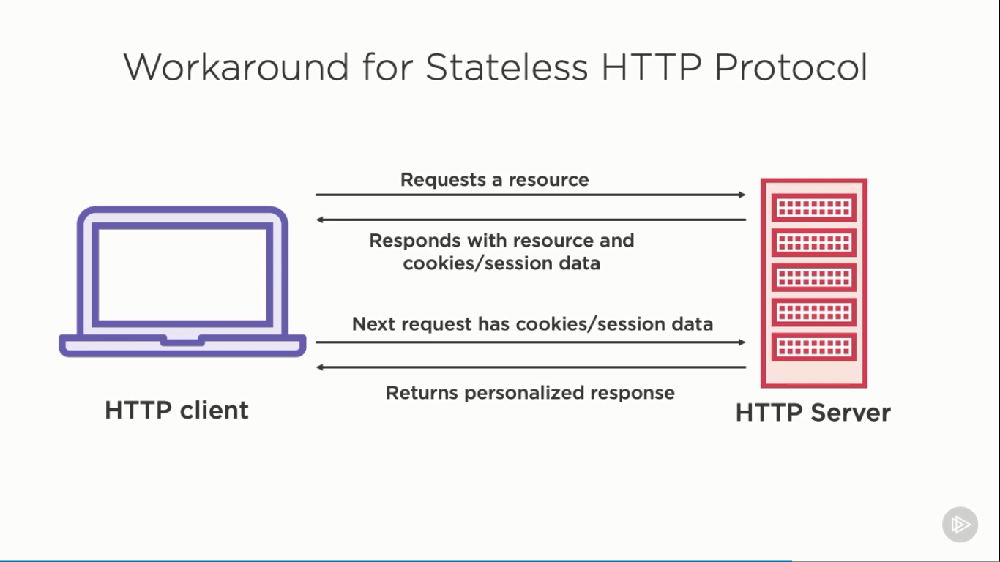
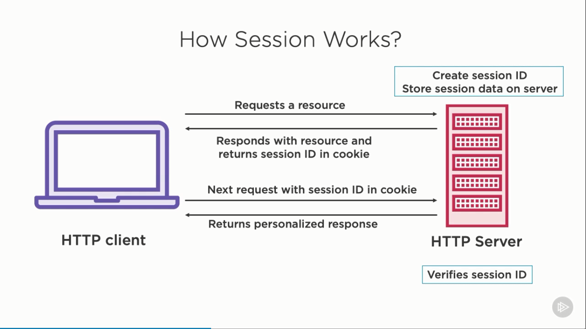
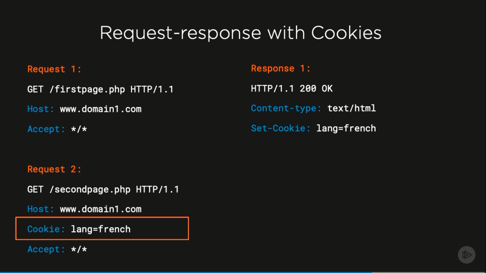
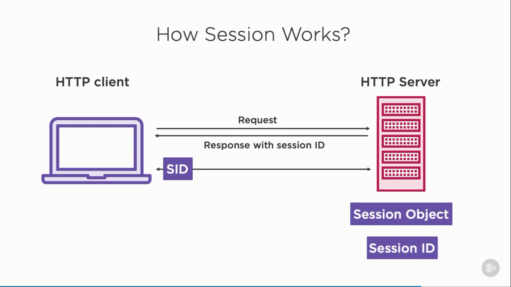

# Cookies and Sessions in PHP

HTTP is stateless protocol.

Sessions and Cookies were created to maintain state between HTTP requests.



Cookies and Sessions

- Remember stateful information for stateless HTTP Protocol
- Helpful for personalizing user experiences
- Global storages to store data persistently for a site
- `$_COOKIE` for cookies
- `$_SESSION` for sessions

## Introducing to Cookies

Cookies were introduced before sessions. When cookies were invented, it was used
to store small user preferences.

Properties

- Stored in the client-side
- Size of cookies is limited to 4KB in any browser
- Only domains which create the cookie can access them
- At least 50 cookies per domain
- At least 3000 cookies in total

Cons of using cookies

- Security concern
- Limited storage
- Bigger request size

## Introducing to Sessions

> Session starts when you open an application, continues until you work on it
> and ends when you close the application



Properties

- Session is maintained by the server
- Session is associated with Session Identifiers, called SID
- Session uses cookie to transfer SID
- If cookie is disabled, URL is used

Benefits of Sessions over Cookies

- Data security
- More storage
- Smaller request size

Cookies vs. Sessions

|                                     Cookies | Sessions                              |
| ------------------------------------------: | :------------------------------------ |
|                       Maintained on browser | Taken care by server                  |
|               Limited amount of data of 4KB | Unlimited amount of data              |
|                    Easy to use, less secure | Not so easily accessible, more secure |
| Cookie is sent to server with every request | Session ID is sent to server          |
|        Uses super global variable $\_COOKIE | Uses super global variable $\_SESSION |

## Working With Cookies

Overview:

- Creating Cookies
- Implementing Cookies
- Deleting Cookies
- Best Practices

### 1. Remainder

- Cookies are set by the server and stored client-side
- It helps preserving the state of the HTTP protocol
- Stored in `$_COOKIE` at key-value pair
- Limited data storage
- Cookies are used to:
  - identify unique visitors
  - personalize the user experience
  - track the pages visited by a user
- Cookies rely on the HTTP protocol

Sample Request - Response with Cookies



For this cookie to exist, there has to be a request-response scenario

- A user sends a request for the page that sets cookies
- The server then sets the cookie on the user's computer
- Other page requests from the user will send the cookie name and value

### Creating Cookies

```php
setcookie(string $name, string $value='', array $options=[]) : bool
```

Required

- `$name`: name of the cookie
- `$value`: value or information to be stored in the cookie

Options

- `$options`: associative array with the following keys
  - `expires`: specifies when the cookie expires, used with `time()`
    - for 1 hour: `setcookie(name, value, time() + 3600)`
    - for 1 day: `setcookie(name, value, time() + 86400)`
    - for 30 day: `setcookie(name, value, time() + 86400 * 30)`
    - empty: the cookies will expire when the session end (when user close the browser)
  - `path`: server path or the path of the domain to which cookie is sent.
    We can specify the directories for valid cookies as well
    - Example: for domain1.com
      - `setcookie(name, value, time()+3600, '/php/')`: the cookie will only valid for `domain1.com/php/` and its subdirectories
      - `setcookie(name, value, time()+3600, '/')`:: valid for every route
  - `domain`: name of the domain, for which the cookie will be active
    - `www.domain1.com`: the cookie only valid for `www`
    - `domain1.com`: any and all subdomains of `domain1.com`
  - `secure`: if cookie should be transmitted only over secure HTTPS connection, default is `FALSE`
  - `httponly`: cookie will only be available through the HTTP protocol, meaning that client side languages such as JS or VBScript can't access the cookie
  - `samesite`: specifies if the cookie should be sent for the cross-site requests
    - `None`: cookies can be used accross sites
    - `Lax`: same-site requests and standard `<a=href=...>` link for target sites
    - `Strict`: only same-site request, no cross-site at all

```php
$options = array(
    'expires' => time() + 60*60*24,
    'path' => '/',
    'domain' => '.domain1.com',
    'secure' => true, // or false
    'httponly' => true, // or false,
    'samesite' => 'None' // or Lax or Strict
);
setcookie('lang', 'french', $options);
```

- Cookies are transferred in HTTP headers
  These HTTP headers are always sent at the top of an HTTP document before any other data.
  Thus, the PHP `setcookie` function
- `setcookie()` should be called before any output to the browser
  - before `<html>`
  - before `echo()` or `print()`

### Updating Cookies

Using `setcookie` function with the updated value

### Deleting Cookies

- Cookies are saved in `$_COOKIE`
- `unset($_COOKIE['name'])`: only delete cookie data at server-side
- Alter cookie with the time in past to delete cookie at client-side

  ```php
  options['expires'] = time() - 3600
  ```

### Best Practices When Using Cookies

- No sensitive data
- Filter data coming from cookies - Sanitize data before using `setcookie`
- Set the expiration date
- Set the `secure`, `httponly` and `samesite` option

Limitations of Cookies

- Storing any sensitive data is highly not recommend
- Cookies could be turned off in a browser by the user
- Size of cookies is limited to 4Kb
- Available in `$_COOKIE` only after page is reloaded in the browser
- Same information makes round trip to the server. More the data, larger the request size
- To overcome these limitations, `session` was introduced.

## Working With Sessions

Overview:

- Purpose of sessions
- Starting, using and destroying a session
- Working with session variables
- Using sessions to preserve data
- Storing session data in MySQL database using SessionHandlerInterface

Sessions

- Tool for managing the state of an application
- Global variable stored on the web server
- Stored in PHP super global `$_SESSION` array variable
- Each session is associated with unique id, called `Session ID` or `SID`
- Must be started before any output to the browser
- Data on the server and the cookie in the browser work together
- Server remembers you while working on an application using session
- Automatically deleted when the browser is closed

Why sessions?

- To store data persistenly for an application
- For frequently referred to data
- To store important information securely
- For more storage and smaller request size

How session works?

- HTTP is stateless
- To preverse the application state
  - Cookies shares user data between server and client
  - Sessions uses server storage to store current user information
- Session data can be stored in file or database
- Session ID can be propagated using
  - Cookies
  - URL Parameters
- Using `cookies` to transfer the SID is recommended



### Session Configurations

Ways to config session:

- `php.ini` file: whole server
- Apache configuration file, `httpd.conf`
- `.htaccess` file: current working directory
- `ini_set()`

### Session Configuration Options

- `session.auto_start`: automatically start session.
  Default is `off`.
  Using session in every request without calling to `session_start` function.
- `session.name`: change name of current session & session cookie.
  Default session name is `PHPSESSID`
- `session.save_path`: path where sessions data is stored on file system.
  Default is the server's `tmp` directory
- `session.gc_maxlifetime`: specifies time in seconds for which session data is valid,
  default is 1440 seconds or 24 minutes
- `session.cookie_lifetime`: specifies the lifetime of the cookie sent to browser,
  default is 0
- `session.cookie_path`: sets the cookie path, default is `/`
- `session.cookie_secure`: specifies if cookie should be sent only over a secure http connection,
  of by default
- `session.use_strict_mode`: if enabled, rejects session ID that isn't initialized by server,
  disabled by default
- `session.cookie_httponly`: access cookie through HTTP protocol, disabled by default (enable to reduce XSS attack)
- `session.use_cookies`: specifies if SID will be stored in cookies on client side, enabled by default
- `session.use_only_cookies`: forces session to use only cookie for SID, works in conjunction with `session.use_cookies`
- `session.use_trans_sid`: controls the use of transparent SID, disabled by default
- `session.cache_limiter`: specifies cache control method used for session pages, default is nocache
- `session.cookie_samesite`: controls the accessibility of the cookie in cross-domain requests, should be `Lax` or `Strict`

Learn more at [https://www.php.net/manual/en/session.configuration.php](https://www.php.net/manual/en/session.configuration.php)

### Session Functions

- `session_start()`: starts the session and makes `$_SESSION` available.
  If no session exists for the currently connected client, then a new one will be created.
  Otherwise, the existing one will be restored. This should be called before any output to
  the browser.
- `session_name()`: changes the name of session, same as `session.name`
- `session_id()`: get and/or set the current session id.
  Set new session ID: `session_id('<new SID>')`
- `session_detroy()`: destroys all data registered to a session

Learn more at [https://www.php.net/manual/en/ref.session.php](https://www.php.net/manual/en/ref.session.php)
